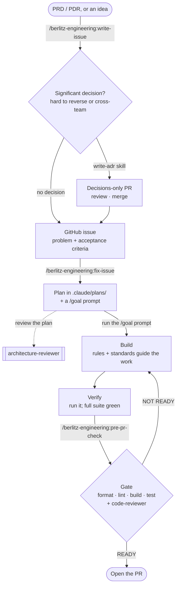

# Engineering Workflow

> How we take a change from idea to merged pull request with your AI coding
> agent and the [`ai-kit`](https://github.com/berlitz-global/ai-kit)
> standards. This is the onboarding guide - read it top to bottom once, then
> keep it as a reference. The depth behind each rule lives in the
> [`engineering-standards`](../.agents/skills/engineering-standards/SKILL.md)
> skill, which your agent loads on demand.

The workflow is a streamlined process: each stage has one job and a clear
definition of "done" before you move on. Most stages map to a single command.



The golden rule sits behind every stage: **define what success looks like, then
loop until it is verified.** You tell your agent the end state; you don't dictate
each keystroke.

---

## Before you start: set the project up once

A project gets the standards once, with:

```text
/berlitz-engineering:setup
```

This stamps in [`AGENTS.md`](../AGENTS.md) (the always-on standards baseline),
the path-scoped [`.claude/rules/`](../.claude/rules/), the
`engineering-standards` and `write-adr` skills, `docs/adr/`, and this
`docs/WORKFLOW.md`. Review and commit the result. You only do this once per
project; later, re-run it with `--reinit` to pull standards updates - it shows
what changed and never overwrites a file you've tuned without asking.

From here on, every stage below is part of the day-to-day loop.

---

## 1. Specify - turn a PRD, PDR, or idea into a well-formed issue

```text
/berlitz-engineering:write-issue [rough idea]
```

The input is whatever defines the work: a reviewed PRD (and its PDRs) when the
product kit (`berlitz-product`) is upstream, or a rough idea or a bug when
`berlitz-engineering` stands alone. Don't start coding from a vague thought. Your agent interviews you one focused round
at a time, grounds the issue in the real code (naming actual components and
files), and drafts a GitHub issue with you. Nothing is filed until you approve
it.

A good issue states the **problem and the acceptance criteria** - not the
solution. The body lands as:

- **Problem** - what's wrong or missing, and why it matters.
- **Proposed approach** - an optional, brief sketch (the real plan comes next).
- **Acceptance criteria** - concrete, checkable conditions for "resolved".
- **Scope & non-goals** - what this covers, and what it deliberately doesn't.

**If the request carries an architecturally significant decision** - a new
service or dependency, a data-model or protocol change, a cross-cutting pattern -
and no **ADR** (Architecture Decision Record - a short Markdown file capturing
a decision and why) settles it yet, `write-issue` handles the *decision* before
the work: it drafts the ADR(s) with you, opens a **decisions-only pull request** for
them (so the team reviews the direction while it's cheap to change), and files
the implementation issue **blocked by that ADR**. You merge the decision first,
then plan the issue. See *Recording decisions* below.

**Done when:** the issue is filed and you have its number - and, if a decision
was in play, the decisions-only ADR PR is open and the issue is gated on it.

---

## 2. Plan - turn the issue into an agreed plan

```text
/berlitz-engineering:fix-issue <issue number>
```

Your agent reads the issue, investigates the codebase to find the **root cause
or the real requirement** (not the surface symptom), then works through the
approach, trade-offs, and open questions *with you* until you agree it's right.

You walk away with two artifacts:

- a plan file in `.claude/plans/issue-<n>-<slug>.md` - problem, approach,
  ordered implementation steps, affected files, the tests to add, risks, and
  success criteria (including the [Definition of Done](../AGENTS.md)); and
- a ready-to-run **`/goal` prompt** - your agent's instruction to execute that
  plan and loop until it's verified.

For anything non-trivial, have the **`berlitz-engineering:architecture-reviewer`** subagent
read the plan before you build. It catches the expensive mistakes - over-
engineering, a wrong boundary, a missed simpler option - while they're still
cheap to change, and tells you whether the decision warrants an ADR (see
*Recording decisions* below).

**Most significant decisions are already settled by now** -
`/berlitz-engineering:write-issue` catches the ones visible up front and opens a decisions
PR before the issue is even filed. But some only surface once you investigate
the code. If one does - hard to reverse, cross-team, a future "why?" with no ADR
to ground it - `/berlitz-engineering:fix-issue` won't bury it in the plan: it raises it, and
if the plan depends on it, settles it first the same way (author it with the
`write-adr` skill, open a decisions-only PR, merge, then implement grounded in
the accepted ADR - holding the `/goal` prompt until it lands). See *Recording
decisions* below.

**Done when:** the plan file is written, you have the `/goal` prompt, and any
significant decision is grounded in an ADR - an existing one, or a
decisions-only PR to merge first.

---

## 3. Build - execute the plan, goal-driven

Run the `/goal` prompt from the previous stage. It names the plan file, states
the measurable end state (new behaviour verified by running it, full suite
green, format/lint/build clean), restricts the change to the files the plan
names, and bounds the run.

While your agent works, the standards guide it automatically - you don't have to
recite them:

- the **path-scoped rules** in [`.claude/rules/`](../.claude/rules/) load
  only for the files they govern (code style, API conventions, security,
  testing, plus your stack's rules);
- the **`engineering-standards`** skill loads when the work calls for deeper
  judgment.

Keep the change **surgical** - touch only what the task needs; note unrelated
problems separately rather than fixing them inline.

**Done when:** every step in the plan is complete and your agent can describe back
what was done, what's verified, and what's left.

---

## 4. Verify - prove it works by running it

Behaviour is verified by **running it**, not by reading the diff. Exercise the
new behaviour, run the full test suite, and confirm the edge cases the issue
called out. New behaviour gets tests; a bug fix gets a test that **fails without
the fix**. If you can't be sure something worked, say so - a half-verified
change is not done.

**Done when:** the behaviour is demonstrably correct and the suite is green.

---

## 5. Review & gate - the pre-PR check

```text
/berlitz-engineering:pre-pr-check            # read-only verdict
/berlitz-engineering:pre-pr-check --loop     # triage → fix → re-review → open PR
```

This is the gate before every pull request. It:

1. runs **format → lint → build → test** for your stack, in order; then
2. hands the diff to the **`berlitz-engineering:code-reviewer`** subagent, which judges it
   against the Definition of Done - completeness, tests, architecture fit,
   quality & safety, correctness.

It reports a table of gate results, the review findings (blocking first), and a
verdict on its own line: **READY TO OPEN PR** or **NOT READY** with a checklist.
By default it is **read-only** - it inspects and reports, and never touches your
code.

Add **`--loop`** to make it iterative: it triages the findings *with you* (you
confirm which are real and in-scope - it won't fix what you dismiss, and never
weakens a test to go green), fixes the confirmed ones, re-gates and re-reviews,
and repeats (bounded to a few rounds) until it's clean - then opens the pull
request with your approval.

**Done when:** the verdict is READY TO OPEN PR (or, with `--loop`, the PR is
open).

---

## Recording decisions - ADRs

A decision that's **hard to reverse, affects more than one team, or that a
future reader would ask "why was it done this way?"** gets recorded as an ADR -
and recorded *before* code is built on it. Routine, easily-reversible choices
don't need one.

The cheapest place to catch these is **specification** (stage 1): when the
request itself carries the decision, `/berlitz-engineering:write-issue` settles it first -

1. draft the ADR(s) with you - via the `write-adr` skill - and scaffold them in
   [`docs/adr/`](adr/README.md);
2. open a **decisions-only PR** - the ADR(s) alone, no implementation - so other
   developers review and refine the direction while it's still cheap to change;
3. merge it; then
4. work the implementation issue (filed **blocked by the ADR**) in a **separate**
   PR, grounded in the accepted decision.

If a decision only becomes clear later, while planning, `/berlitz-engineering:fix-issue`
runs the same play as a safety-net. Either way, keeping the decision and the
implementation in separate PRs is the same instinct as *one concern per PR*: a
reviewer judging "should we do it this way?" shouldn't have to read the diff
that already assumes yes.

---

## 6. Ship - open the pull request

With a READY verdict, open the PR - yourself, or let `/berlitz-engineering:pre-pr-check
--loop` do it as the final step of the review loop. Either way, hold it to the
standards:

- **One concern per PR.** Split unrelated changes; refactors and behaviour
  changes land separately.
- **Commit messages explain *why*,** in the imperative mood.
- **The description** covers what changed, why, how it was tested, and any risk
  or follow-up - and links the issue or ADR.

---

## Where the standards live

This guide is the *process*; the *standards* it serves live in their own
always-loaded files, so there's a single source of truth - no copy here to drift
out of sync:

- the **Definition of Done**, the checklist every change must meet, is the
  always-on contract in [`AGENTS.md`](../AGENTS.md) - `/berlitz-engineering:pre-pr-check`
  walks it for you;
- the **engineering principles**, the testing deep-dive, and the review and
  architecture guidance are the
  [`engineering-standards`](../.agents/skills/engineering-standards/SKILL.md)
  skill, which loads on demand;
- **path-scoped rules** in [`.claude/rules/`](../.claude/rules/) govern the
  files they apply to.

---

## Quick reference

| When you want to… | Use |
| ----------------- | --- |
| Install the standards in a project | `/berlitz-engineering:setup` |
| Turn an idea into a filed issue | `/berlitz-engineering:write-issue` |
| Turn an issue into a plan + `/goal` prompt | `/berlitz-engineering:fix-issue <n>` |
| Review a plan before building | `berlitz-engineering:architecture-reviewer` subagent |
| Run the gate before a PR | `/berlitz-engineering:pre-pr-check` |
| Review a diff against the standards | `berlitz-engineering:code-reviewer` subagent |
| Author an ADR | [`write-adr`](../.agents/skills/write-adr/SKILL.md) skill |
| Read the full standards playbook | [`engineering-standards`](../.agents/skills/engineering-standards/SKILL.md) skill |
| See the rules that govern a file | [`.claude/rules/`](../.claude/rules/) |
